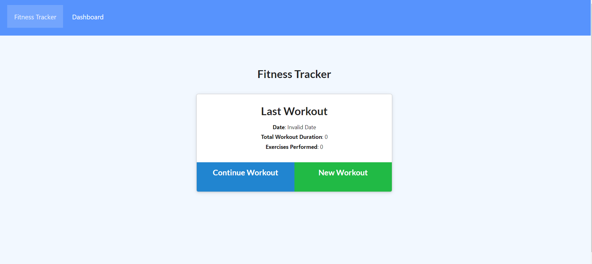

  # Workout tracker
  ## Table of contents
  * [Description](#Description)
  * [Usage](#Usage)
  * [Questions](#Questions)
  * [Contact](#Contact)

  ## Description
  This is my workout tracker app, it's meant to show that I am able to create an app that will do the following. Log a users workouts to a database specifically mongoDB   and deminstrate a serverless project as it is hosted on Heroku.
 
  ## Usage
  visit the deployed site on heroku here https://limitless-dawn-11698.herokuapp.com/?id=61732cec0567e600160fda5a and track your workouts if youd like!

  
  
  ## Questions
  If you have any questions feel free to contact me at the links below.
  
  ## Contact
  https://www.linkedin.com/in/cedar-halvorson-10791020a/
  [github profile](https://github.com/CedarHalvorson)  
  Email cedarhalvorson@gmail.com  
 
